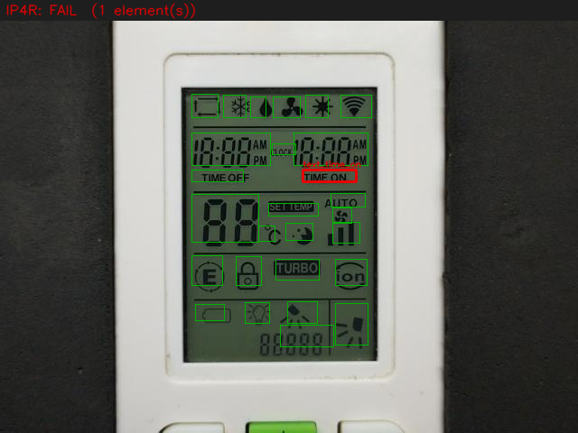

# IP4R — AC-Remote LCD Splash-Screen QC

Image-based production quality check for AC-remote LCDs. Point it at a photo of a
remote in its **all-segments-on self-test ("splash") state** and it decides
**PASS / FAIL** by verifying every digit, segment, icon and printed label is present,
correctly shaped, and clean — and tells you **which element failed**.

The golden reference (`data/reference/lcd_all_on.jpg`) *is* the spec: everything that
should ever light up is lit in it.



> Why this design and not a neural net: the expected appearance is fully known, so this
> is a **golden-template inspection** problem. A registration-anchored, ROI-scoped
> classical pipeline is training-free, CPU-real-time on a Mac, and fully explainable.
> Deep anomaly detection (Anomalib PatchCore/PaDiM) is kept as an optional Tier-B net.
> Full reasoning + references: **[`docs/literature_survey.md`](docs/literature_survey.md)**.

## How it works
```
preprocess → register (ORB+RANSAC → ECC sub-pixel) → per-ROI checks → decide → report
                                                        ├─ coverage : is it lit/present?
                                                        └─ SSIM     : is it shaped right/clean?
```
- **Coverage** catches missing/partial segments and unlit icons.
- **SSIM** catches smear, blur, low contrast, mura.
- Both run *after* registration (SSIM is not shift-invariant).
- This panel is a **reflective LCD** (dark active segments on a light background) — handled
  by `tier_a.coverage.active_is_dark: true` in the config. Flip it for emissive/LED panels.

## Install (macOS, Apple Silicon — CPU only)
```bash
cd ip4r
python3 -m venv .venv && source .venv/bin/activate
pip install -e .
```
Optional deep Tier-B (heavy, pulls PyTorch; runs on CPU or Apple MPS):
```bash
pip install -e ".[dl]"
```

## Quickstart
```bash
# 1) sanity: golden vs itself -> all PASS (proves the pipeline runs)
ip4r selfcheck

# 2) prove it end-to-end with no real defects yet — synthesise one and inspect it
ip4r synth --mode erase --out data/samples/defect_01.jpg
ip4r inspect data/samples/defect_01.jpg          # -> FAIL, localized to the erased element

# 3) inspect a real image or a whole folder
ip4r inspect path/to/photo.jpg
ip4r inspect data/samples/

# 4) author / refine the ROI map on the golden (draw boxes, name them)
ip4r roi-edit
```
`synth` modes: `erase` (missing element), `dim`, `blur` (quality), `shift` (pose).
Outputs (annotated overlay PNG + JSON report) land in `data/results/`.

## Configuration
Everything tunable lives in [`config/default.yaml`](config/default.yaml): preprocessing,
registration params, per-ROI thresholds (`coverage_ratio_min`, `ssim_min`), panel polarity,
and the Tier-B switch. Pass a different file with `ip4r --config my.yaml ...`.

## Status & honest limits
Works today on the deterministic Tier-A path with a 27-element starter ROI map. Known calibration
points (see roadmap in [`CLAUDE.md`](CLAUDE.md)):
- **Thresholds are starting values.** Subtle quality defects (e.g. *mild* blur) sit near the SSIM
  threshold; the conservative default avoids false fails from registration jitter but can miss them.
  The fix is data-driven calibration (T2) or enabling Tier B — not a magic constant.
- The starter ROI map is approximate; refine it with `ip4r roi-edit`.
- Rebuild the golden as the **mean of several good captures** once available (kills single-photo glare bias).

## Layout
```
config/        thresholds + paths (default.yaml)
data/          reference/ (golden + rois.yaml), samples/, results/
src/ip4r/      pipeline, registration, inspect, segments, report, synth, cli, tools/roi_editor
docs/          literature_survey.md  <- method selection & references
tests/         pytest smoke tests
CLAUDE.md      project context + roadmap for Claude Code
```

## Docker deployment

Two images are provided — choose based on whether you need Tier B deep anomaly detection.

| Image | Deps | Approx. size | Use when |
|---|---|---|---|
| `ip4r:tier-a` | numpy · opencv-headless · scikit-image · PyYAML | ~500 MB | production line, CPU-only, no GPU |
| `ip4r:tier-ab` | above + PyTorch (CPU) + Anomalib | ~3 GB | Tier B enabled, good-bank trained |

### Build
```bash
# from the IP4R/ root
docker compose -f deploy/docker-compose.yml build          # both images
docker compose -f deploy/docker-compose.yml build tier-a   # just Tier A
```

### Run
```bash
# sanity check — golden vs itself, should be all-PASS
docker compose -f deploy/docker-compose.yml run --rm tier-a selfcheck

# inspect a single image (path relative to the container's /app)
docker compose -f deploy/docker-compose.yml run --rm tier-a inspect data/samples/photo.jpg

# inspect a whole folder
docker compose -f deploy/docker-compose.yml run --rm tier-a inspect data/samples/

# synthesise a defective sample then inspect it
docker compose -f deploy/docker-compose.yml run --rm tier-a synth --mode erase --out data/samples/defect_01.jpg
docker compose -f deploy/docker-compose.yml run --rm tier-a inspect data/samples/defect_01.jpg
```

`data/samples/` and `data/results/` are bind-mounted from your host, so outputs land locally at `IP4R/data/results/`.

### Enabling Tier B inside the container
Create a config override that flips the switch:
```yaml
# config/tier_ab.yaml  (inherits everything else from default.yaml)
tier_b:
  enabled: true
```
Then uncomment the volume line in `deploy/docker-compose.yml`:
```yaml
- ../config/tier_ab.yaml:/app/config/default.yaml
```
and rebuild the `tier-ab` service.

## Tests
```bash
pip install -e ".[dev]" && pytest -q
```
